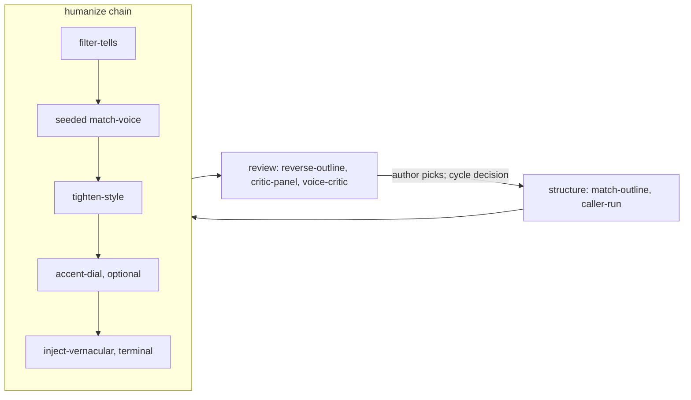

# writing-skills

Claude Code skills that rewrite AI-drafted prose until it reads as human, measured against the Pangram detector, with reference management and citation auditing alongside.

An AI-generated draft reveals itself in three ways — rhetorical scaffolding, semantic tells, and the drafting model's lexical fingerprint — and fixing one leaves the other two untouched. The pipeline attacks all three in sequence — a structural pass reshapes the prose away from its source, a semantic pass erases the tells, and a cross-model diction pass strips the model's imprint — with a detector score recorded before and after each step. Verified on a published article: 100% AI to mixed, mean window score 0.993 to 0.576.



## Scope and Status

The repository hosts 19 skills and 3 commands, canonical under `.claude/`. They fall into four categories (GH-208).

**The humanize chain** — `humanize` orchestrates one generative pass: `filter-tells` (semantic cleanup), `match-voice` (seeded cross-model diction rewrite, plus the optional burstiness pass), `tighten-style` (word recovery toward the author's density floor), `accent-dial` (optional L2-accent stage), and `inject-vernacular` (the deterministic terminal stage). `match-structure` is the shared library underneath — metrics, anchor retrieval, venue profiles.

**Structure, caller-run** — `match-outline` rewrites a whole document against a blueprint. It is invoked by a workflow before the chain, never by the chain: humanize's input contract assumes its work is done.

**Review instruments, caller-run** — after the chain's terminal stage: `reverse-outline` labels the argument as RST markers and ranks every paragraph by what deletion costs, `critic-panel` reads a finished draft through named persona critics in parallel and merges them into one convergence-first sheet, `critic-apply` applies that sheet by rule through the rewrite transport, `cold-review` runs the fresh-context entailment check whose only repairs are verbatim reverts, and `voice-critic` gatekeeps against the author's voice constitution. Applied picks re-enter the chain as a new cycle.

**Data and corpus tools** — `update-references` and `audit-references` keep a CSL-YAML bibliography current and checked against retrieved sources; `tune-anchors` sweeps anchor queries; `bake-off` compares models over multiple payloads so the chain's defaults can be pinned; `patent-disclosure` populates an eleven-section invention-disclosure template; `pattern-language` extracts Alexandrian pattern languages from repositories. These maintain data, not prose — a different kind from the chain's stages.

The commands — `brainstorm-article`, `write-article`, `seo-pass` — drive an end-to-end article pipeline. History traces back to [coding-skills](https://github.com/petar-djukic/coding-skills), where these skills lived through August 2026; the coding commands remain there.

## Documentation

The pipeline is described in [How to Build a Writing Pipeline](https://meshintelligence.substack.com/p/how-to-build-a-writing-pipeline?utm_source=github&utm_campaign=writing-skills) — the three passes, why fixing one tell class leaves the others, and the detector scores before and after each step.

Two books draft their chapters through it: [agentic-coding-book](https://github.com/petar-djukic/agentic-coding-book) and [agentic-applications-book](https://github.com/petar-djukic/agentic-applications-book). Chapters run as articles first, so the skills here are what shapes them.

## Methodology

The target voice sits in a `writing-voice/` directory of exemplar prose — the contract is in [.claude/rules/writing-voice.md](.claude/rules/writing-voice.md). Skills gauge a draft's distance from that corpus, pull anchors from it, and gate every rewrite: a candidate must keep citations, numbers, and meaning, or the original remains. The external Pangram check is consent-gated per document; everything else runs locally against an Ollama endpoint.

## Repository Structure

```
.claude/skills/      the 12 skills, one directory each
.claude/commands/    brainstorm-article, write-article, seo-pass
.claude/rules/       writing-voice contract, technical document types
.claude/scripts/     shared plumbing: credentials, Pangram client, prose parsing
scripts/             mirror sync
```

## Environment

Run the test suite with `scripts/run-tests.sh` (or `mage test`); `mage tag` runs the same gate from a clean `main` and creates the next `v0.YYYYMMDD.N` release tag, counting revisions over local and remote tags.

[pixi](https://pixi.sh/) manages Python dependencies. `pixi.toml` and `pixi.lock` ship in `.claude/`, and `.claude/scripts/ensure-env.sh` provisions the locked environment. Credentials (`pangram`, `serpapi`, `semantic_scholar`) resolve through a gitignored `.secrets/` directory per the contract in the skills' documentation; no credential is ever committed or printed.

## License

MIT. See [LICENSE](LICENSE).
